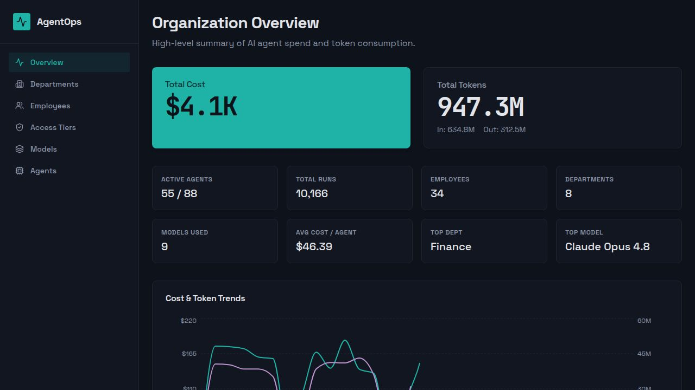
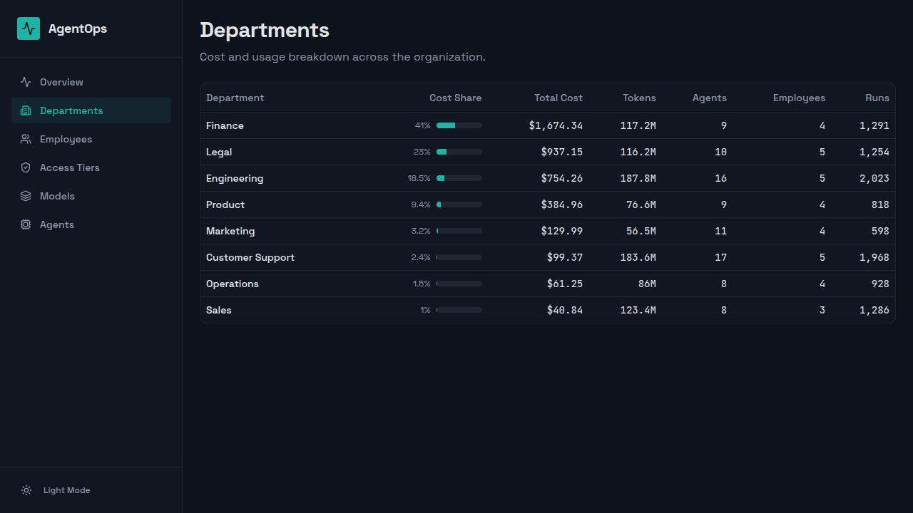
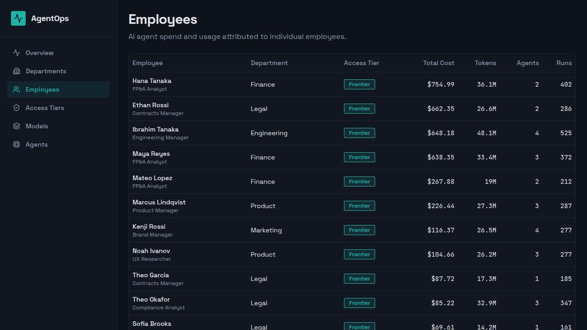
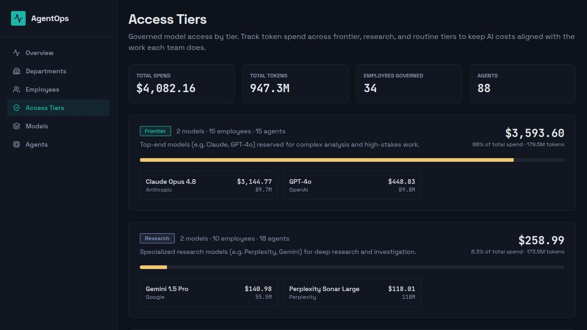
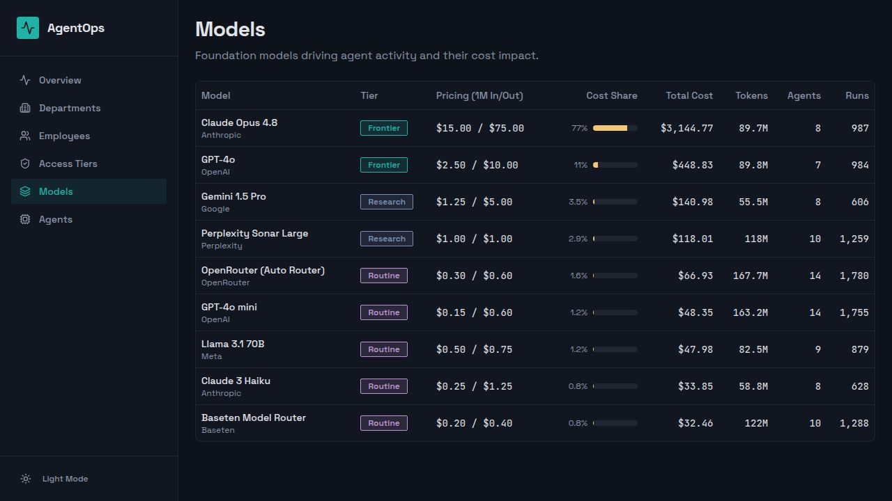
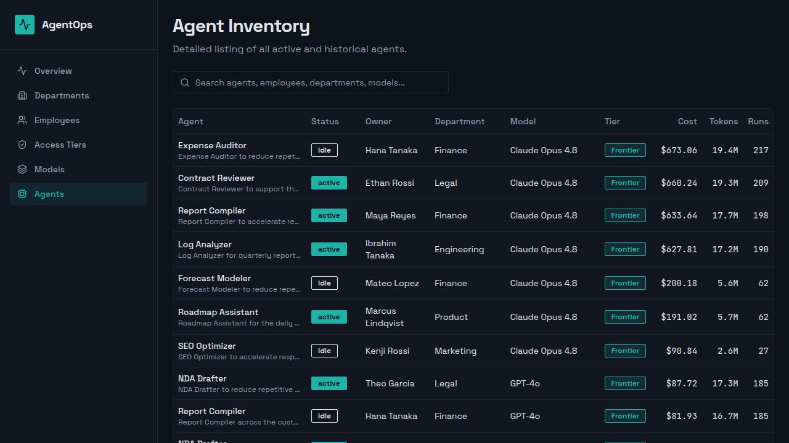

# AgentOps — AI Agent Observability for Finance

A dashboard that gives a CFO clear visibility into AI agent spend and token
consumption across the organization. Every cost figure is derived from actual
token usage × each model's per-million price — costs are never stored, so the
numbers always reflect current pricing.

## Tiered model access

Model access is governed by tier so spend stays aligned with the work each team
does:

- **Routine** — high-volume, low-cost models (routers, small models) for everyday tasks
- **Research** — web-grounded / research models for deep investigation
- **Frontier** — top-end models (Claude Opus 4.8, GPT-4o) reserved for complex, high-stakes work

Each employee is granted an access tier, each model belongs to a tier, and the
**Access Tiers** page rolls spend up by tier so the CFO can see exactly where
the budget goes.

## Screenshots

### Organization Overview

### Departments

### Employees

### Access Tiers

### Models

### Agents

## Stack

- pnpm workspaces (monorepo), Node.js 24, TypeScript 5.9
- Web: React + Vite (`artifacts/agent-observability`)
- API: Express 5 (`artifacts/api-server`)
- DB: PostgreSQL + Drizzle ORM (`lib/db`)
- API contract + codegen: OpenAPI + Orval (`lib/api-spec`)

## Run & operate

- `pnpm --filter @workspace/api-server run dev` — run the API server
- `pnpm --filter @workspace/agent-observability run dev` — run the web app
- `pnpm --filter @workspace/db run push` — push DB schema changes (dev only)
- `pnpm --filter @workspace/scripts run seed` — seed sample data
- `pnpm --filter @workspace/api-spec run codegen` — regenerate API client + Zod schemas
- `pnpm run typecheck` — full typecheck across all packages

Required env: `DATABASE_URL` — Postgres connection string.
